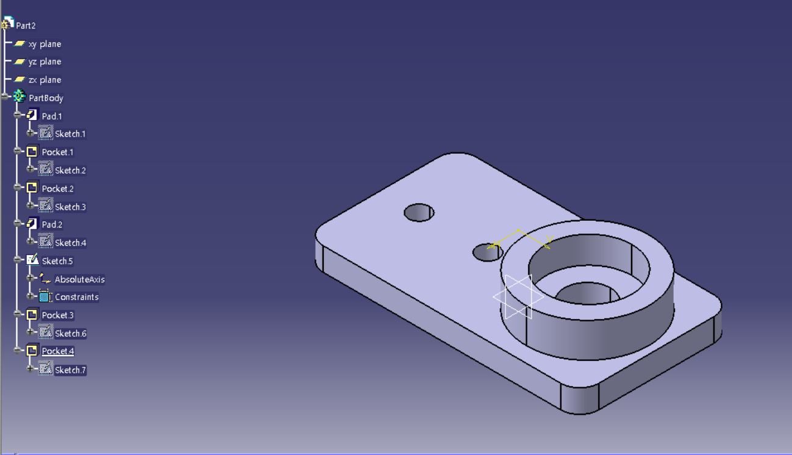
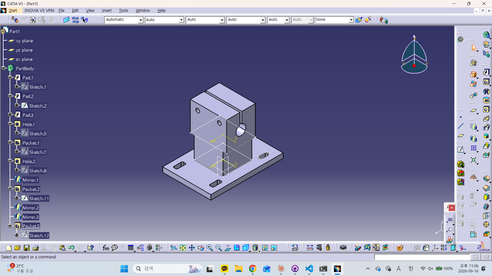

# CATIA 연습 기록

지그 설계(3주차) 전에 감 잡기용으로 실제 부품을 하나씩 모델링하면서 남기는 기록.
각 항목은 날짜 · 작업 · 사용 명령 · 막힌 것 · 다음 할 것 순서로 짧게.

## 2026-09-15 베어링 하우징 (JIG-B-01)

- 파일: `bearing_housing.CATPart`
- 작업: 40×72×6 플레이트 + Ø32 보스(높이 10), 베어링 포켓 Ø22.4 깊이 7, Ø12 관통, 볼트홀 2×Ø5.5(간격 18), 코너 R5
- 사용 명령: Pad ×2, Pocket ×4, 스케치 구속
- 잘된 것: 전체 형상은 도면대로 나옴 (플레이트·보스·포켓·관통·볼트홀)
- 고칠 것
  - 구멍을 전부 Pocket으로 뚫음 → 볼트홀·Ø12 관통은 Hole 명령으로 교체 (Positioning Sketch로 위치 구속, 보스 동심은 원 모서리 + 면 Ctrl 선택)
  - Sketch.5 빈 스케치 삭제
  - 코너 R5를 스케치에서 그림 → Edge Fillet 피처로 변경
  - 포켓 입구 Chamfer C1 아직 없음
  - 피처 이름 정리 (Pad.1 → Plate, Pad.2 → Boss, Pocket.3 → BearingPocket …)
- 다음: 위 수정 후 Drafting 워크벤치에서 삼면도 + 단면 A-A 뽑기
- 캡처: 

## 2026-09-16 센터 마운트 (JIG-C-01)

- 파일: `center_mount.CATPart`
- 작업: 플랜지 60×40×4 + 기둥 24×24×18 + 클램프 블록 24×30×24, 보어 Ø8.2 관통(높이 33), 슬릿 1.5, 클램프 볼트홀 2×Ø3.2(Y=±9, Z=41), 슬롯 4× 3.4×8
- 사용 명령: Pad ×3, Hole ×2(Positioning Sketch로 위치 구속), Pocket(슬릿·슬롯), Mirror ×3, 스케치 Corner
- 잘된 것: 3층 구조·보어·슬릿·볼트홀 도면대로 나옴. 구멍은 처음부터 Hole 명령으로 함
- 막힌 것
  - 슬롯 4개를 Mirror로 만들려다 "Mirror로 만든 피처는 다시 Mirror 불가" 에러 → 네 번째 슬롯은 Pocket.5로 따로 뚫음. 다음엔 Rectangular Pattern(44×28, 2×2)으로
  - 기둥 밑동 Edge Fillet R3: Pad할 때 겹치는 오류(Pad.2·Pad.3 겹침)로 밑동 모서리가 인식되지 않아 필렛 불가 ("Edges or face not found"). 다른 모서리는 정상 → 기둥/블록 스케치 평면 재확인 필요
- 고칠 것
  - mirror 문제를 그냥 스케치+포켓으로 해결
- 캡처: 

## 연습 후보 (진행 순서)

1. ~~베어링 하우징 (JIG-B-01)~~ (수정 사항 남음)
2. ~~센터 마운트 (JIG-C-01)~~ (수정 사항 남음)
3. 2020 프로파일 단면 스케치 → Pad (프레임 부재)
4. 1축 지그 Assembly Design (프로파일 + 하우징 + 샤프트 + 암), 회전 자유도 1개만 남기기
5. 브라켓 도면 1장 (치수·공차)
