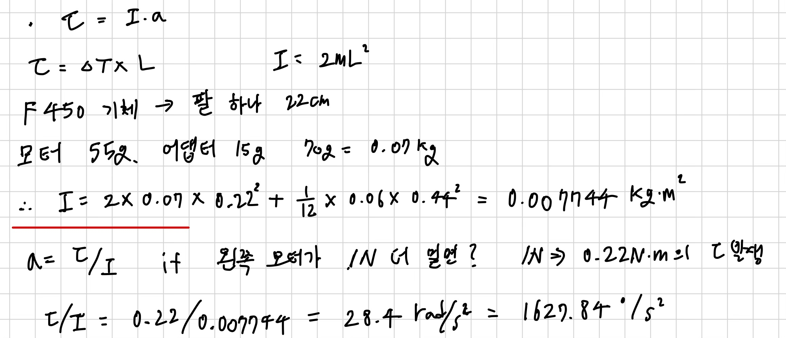

# 진행 기록

## 2026-09-14
- 저장소 만들고 계획 잡음
- 부품 주문
  부품명 / 수량 / 가격(일괄,KRW)
  STM32 Nucleo-F446RE / 1개 / 36000
  BLDC 브러시리스 모터 2212 1000KV + 30A ESC + 1045 프로펠러 세트 [TYE-DR059] / 3개 / 54000
  MPU-6050 IMU / 2개 / 9000
  터미널블럭 to DC 커넥터 (DC2.1 FEMALE) [SZH-LC002] / 2개 / 1000
  아답터, 220v / 12V 10A 젠더 세트 4종 젠더 HT-AD011 / 1개 / 36300
  830핀 브레드보드 전원 공급 키트 [MD0187] / 1개 / 4400
  방수캡 토글 스위치 ON-OFF 2단스위치 15A 12mm [T-TS15A2P] / 1개 / 2700
  보안경 / 1개 / 2800
  테스트[CH254] 소켓 점퍼 케이블 40P (칼라) (M/F) 20cm / 1개 / 850
  NT- DIY 수축튜브 328세트 / 1개 / 3900
  전기 인두기 세트 / 1개 / 17500
  ----------------------------------------------------------------------------------------
  합계 : 부가세 포함 183545 (KRW)

- 1축 관성모멘트 계산해보기
  I = 2×0.07×0.22² + (1/12)×0.06×0.44² = 0.007744 kg·m²
  왼쪽 모터가 1N 더 밀면 τ = 0.22 N·m, α = 28.4 rad/s² = 1627.84 °/s²
  → 0.2초면 30도 넘게 기움. 100Hz 루프, 게인 작게, 지그에 각도 스토퍼 필요
  
